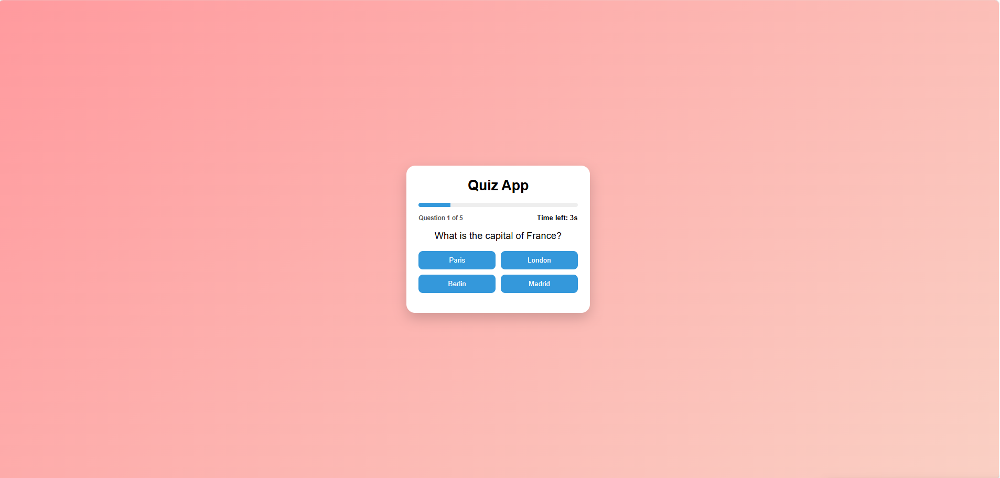

# Quiz App

Interactive Quiz App built with HTML, CSS and JavaScript.

## Features

- **Dynamic Data:** Fetches questions from the OpenTDB API.
- **Customizable:** Start screen with category and difficulty filters.
- **Game Mechanics:** 10 seconds timer per question, randomized answers, and score tracking.
- **Interactive UI:** Animated feedback for correct / wrong answers, dynamic progress bar, and question counter.
- **History Tracking:** Saves and displays the history of your last 5 attempts using `localStorage`.
- **Responsive & Accessible:** Mobile-friendly design with keyboard navigation support (`:focus-visible`).

## Technologies

- HTML
- CSS
- JavaScript

## Project Goal

This project was built to practice:
- DOM manipulation
- Event handling
- State management
- Timers (`setInterval`)
- Dynamic UI updates
- Working with REST APIs and async/await
- Error handling and Edge cases

## Future Improvements

- Add sound effects
- Add support for multiple players

## Live Demo

[Open Project](https://quiz-app-archyteam.netlify.app)

## Screenshot

## Version

### V2.1

- Added OpenTDB API integration
- Added dynamic difficulty and category via API
- Implemented `async/await` data fetching
- Added CSS Spinner for loading state
- Replaced native `alert()` with a custom UI error handler
- Implemented answer shuffle (Fisher-Yates algorithm)
